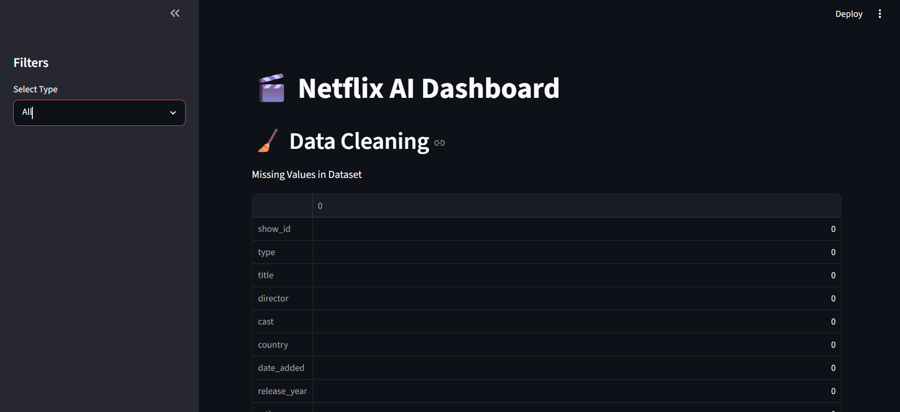
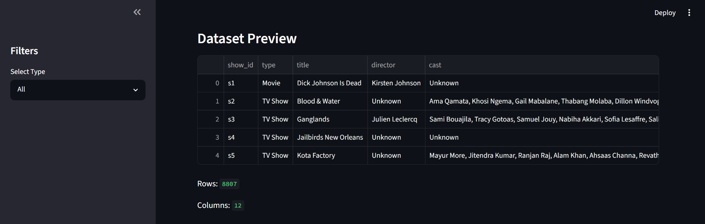
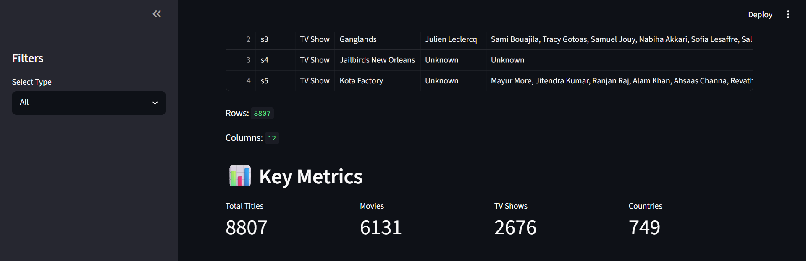
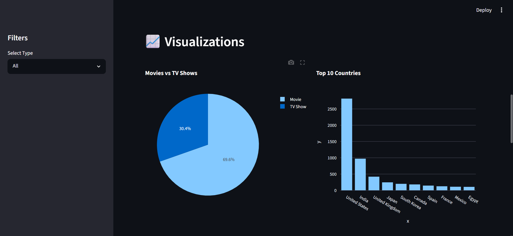
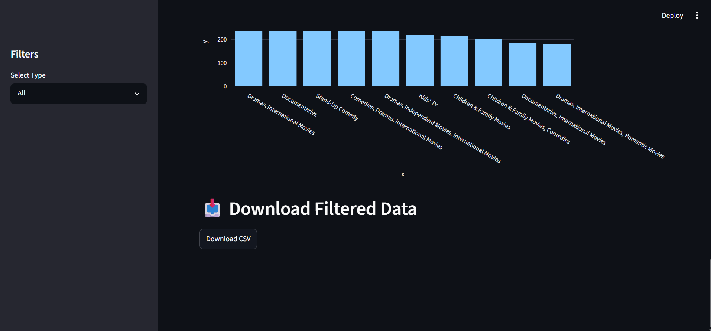

# Netflix AI Dashboard

## Overview

Netflix AI Dashboard is an interactive data visualization application built using Streamlit, Pandas, and Plotly. The dashboard provides insights into Netflix Movies and TV Shows through data cleaning, KPI metrics, interactive filters, and visual analytics.

## Features

- Dataset Overview
- Data Cleaning
- KPI Metrics
- Interactive Filters
- Movies vs TV Shows Analysis
- Top 10 Countries Analysis
- Ratings Distribution
- Content Added Over Years
- Top Genres Analysis
- Download Filtered Dataset

## Technologies Used

- Python
- Streamlit
- Pandas
- Plotly
- NumPy

## Dataset

Netflix Movies and TV Shows Dataset from Kaggle.

## How to Run

1. Install dependencies:

```bash
pip install -r requirements.txt
```

2. Run the application:

```bash
streamlit run app.py
```

## Screenshots

### Dashboard Home


### Data Cleaning


### KPI Cards


### Visualizations


### Download Feature


## Author

Rishi Rs
